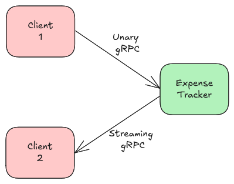

# Expense Tracker with gRPC



This is a toy example demonstrating two types of RPC communication models: _unary_ and _server-streaming_. The system consists of three applications:
- __expense tracker service__: stores user expenses and computes user total balance.
- __client 1__: creates and sends expenses to the expense tracker service via unary gRPC.
- __client 2__: receives the current total balance for each user via server-streaming gRPC.

An expense is defined by the following fields:

| __Field__      | __Type__ | __Description__                                               |
|----------------|----------|---------------------------------------------------------------|
| `id`           | `string` | Unique identifier for the expense                             |
| `user_id`      | `string` | ID of the user who made the expense                           |
| `category`     | `string` | Category of the expense (e.g., Food, Rent, Transport)         |
| `amount`       | `double` | The amount spent                                              |
| `description`  | `string` | Optional description of the expense                           |
| `timestamp`    | `string` | Date of the expense (ISO 8601 format `2025-03-09T02:27:40Z`)  |

The gRPC endpoints of the expense tracker service are shown below:

| __Method__      | __Description__                         | RPC Communication Model | 
|-----------------|-----------------------------------------|-------------------------|
| `CreateExpense` | Adds a new expense entry                | Unary                   |
| `GetBalances`   | Streams the total balances of all users | Server Streaming        |

## Build

Install the protobuf compiler and associated go tools:

```bash
sudo apt install -y protobuf-compiler
go install google.golang.org/protobuf/cmd/protoc-gen-go@latest
go install google.golang.org/grpc/cmd/protoc-gen-go-grpc@latest
go install github.com/fullstorydev/grpcurl/cmd/grpcurl@latest
```

Compile the proto files and build the applications:

```bash
make protoc
make build
```

## Run

1. Run `make run-server`
2. On a separate terminal, run `make run-client-1`
3. On a separate terminal, run `make run-client-2`
